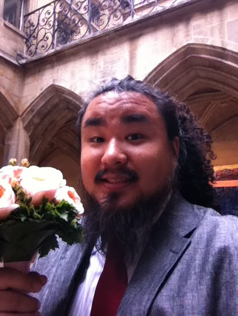

Thanks for visiting my page.

 I am Yuji Oyamada (小山田 雄仁), an assistant professor, Department of Electrical Engineering and Computer Science at Tottori University (鳥取大学 工学部 電気情報系学科) since April 2015. I received all my degrees B.E., M.E., and Ph.D. of Engineering from Keio University in 2006, 2008, and 2011 respectively. 

Before joining Tottori University, I was a postdoctoral researcher in Keio University from October 2011 to February 2012, a visiting researcher at the chair for Computer Aided Medical Procedure (CAMP), TUM from March 2012 to March 2013, and a junior researcher in School of Fundamental Science and Engineering, Waseda University, Japan from April 2013 to March 2015. 

My research interests range from basic Computer Vision problems to their practical applications (see here for further detail).

## Contacts

- Email: oyamada[at]tottori-u.ac.jp (Please convert [at] to @)
- Skype: [charmie1111](skype:<charmie1111>?call)
- Address: Room 7509, 5th floor, J-th wing, Faculty of Engineering Building, Tottori University, 4-101 Koyama-cho Minami, Tottori, Tottori, 680-8552, Japan
- 住所: 680-8552 鳥取県鳥取市湖山町南4-101 鳥取大学 工学部 J棟 5階 7509

## Our Recent Activities

<figure class="viedeo_container">
<iframe width="100%" src="https://docs.google.com/spreadsheets/d/e/2PACX-1vQex1TN69Z2Yonevsq5u8w13NF5iiHHoOxPOTgkfnN8MMKRtZaZN4-Ltk4eEFRvlFrLzJqu3ymbpJJq/pubhtml?widget=true&amp;headers=false">
</iframe>    
</figure>

