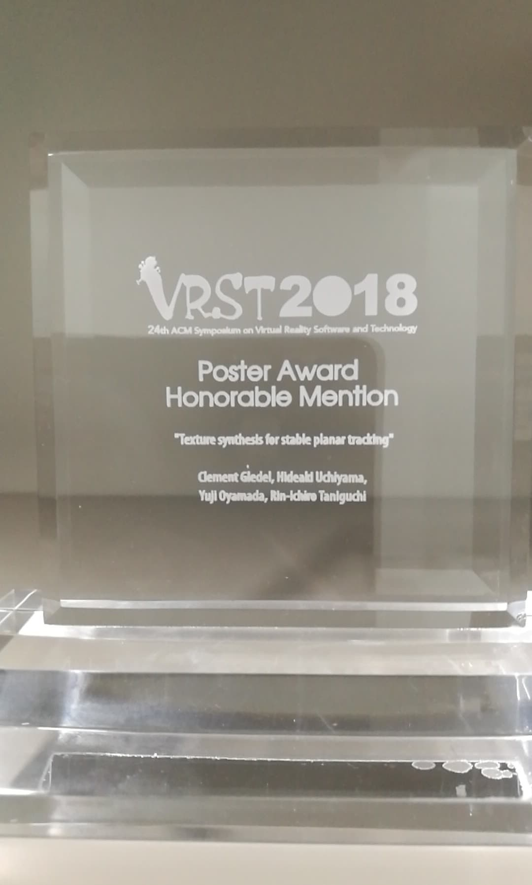

## Journal Papers

1. Risa Nakano, **Yuji Oyamada**, Ryo Ozuru, Satoshi Miyahara, Michinobu Yoshimura, and Kenji Hiromatsu, [*Emulating visual evaluations in the microscopic agglutination test with deep learning*](https://www.sciencedirect.com/science/article/pii/S0167701225001654), Journal of Microbiological Methods, Vol. 237, pp. 107249, 2025. 
1. Risa Nakano, **Yuji Oyamada**, Ryo Ozuru, Michinobu Yoshimura, and Kenji Hiromatsu, [*Objectification of evaluation criteria in microscopic agglutination test using deep learning*](https://www.sciencedirect.com/science/article/pii/S0167701224000678), Journal of Microbiological Methods (Short Communications), Vol. 222, pp. 106955, 2024. 
1. **Yuji Oyamada**, Ryo Ozuru, Toshiyuki Masuzawa, Satoshi Miyahara, Yasuhiko Nikaido, Fumiko Obata, Mitsumasa Saito, Sharon Yvette Angelina M. Villanueva, and Jun Fujii, [*A machine learning model of microscopic agglutination test for diagnosis of leptospirosis*](https://journals.plos.org/plosone/article?id=10.1371/journal.pone.0259907), PLOS ONE, Vol. 16, No. 11, pp. 1-16, Nov., 2021.
1. Takayuki Tomioka, Kazu Mishiba, **Yuji Oyamada**, and Katsuya Kondo, *Depth Map Estimation Using Census Transform for Light Field Cameras*, IEICE Transactions on information and Systems, Vol. E100-D, No. 11, pp. 2711-2720, Nov., 2017.
1. Kazu Mishiba, **Yuji Oyamada**, and Katsuya Kondo, *Content-Aware Image Retargeting Incorporated with Letterboxing*, IEICE Transactions on Information and Systems, Vol. E100.D, No. 4, pp. 865-873, Apr., 2017.
1. Yu Nakajima, Takahiro Nozaki, **Yuji Oyamada**, and Kouhei Ohnishi, *An Object-Coordinate-Based Bilateral Control System Using Visual Information*, Electronics and Communications in Japan, Vol. 96, No. 8, pp. 41-49, Jul., 2013.
1. **Yuji Oyamada**, Haruka Asai, and Hideo Saito, *Blind Deconvolution for A Curved Motion Based on Cepstral Analysis*, IPSJ Transactions on Computer Vision and Applications (CVA), Vol. 3, pp. 32-43, Jun., 2011.

## 和文論文誌

1. 池田 拓也, **小山田 雄仁**, 杉本 麻樹, 斎藤 英雄, *RGB-Dカメラから得られる部分物体形状と影に基づく光源推定*, 映像情報メディア学会誌, Vol. 67, No. 4, pp. J124-J133, Mar., 2013.
1. 中島 悠, 野崎 貴裕, **小山田 雄仁**, 大西 公平, *視覚情報を用いた物体座標系におけるバイラテラル制御*, 電気学会論文誌産業応用部門誌, Vol. 132-D, No.3, pp. 374-380, Mar., 2012.
1. **小山田 雄仁**, 斎藤 英雄, *プロジェクタスクリーン上に生じる焦点ボケ解消のための投影画像の事前補正法*, バーチャルリアリティ学会論文誌, Vol. 12, No. 4, pp. 479-486, Dec., 2007.

## International Conferences, Workshops, Symposiums

1. Mikihiko Mori, Naoki Kajitani, **Yuji Oyamada**, Haruhiko Maenami, *Developing a Reflection Support System in Idea Organization Workshops*, New Perspectives in Science Education 14th Edition, Mar., 2025.
1. Risa Nakano, **Yuji Oyamada**, and Ryo Ozuru, *Objectification of Evaluation Criteria in MAT Using Deep Learning*, 13th Conference of ILS and 4th Meeting of ELS, Sep., 2024. 
1. Madoka Chosokabe, Shohei Koie, and **Yuji Oyamada**, *Examining the Effect of ChatGPT on Small Group Ideation Discussions*, Human-Centric Decision and Negotiation Support for Societal Transitions (GDN), pp. 142-153, May, 2024 ([paper](https://link.springer.com/chapter/10.1007/978-3-031-59373-4_12)).
1. Naoki Kajitani, **Yuji Oyamada**, Mikihiko Mori, Haruhiko Maenami, *Idea Grouping Support System*, International Conference on Software Technology and Engineering (ICSTE), Oct., 2023.
1. Madoka Chosokabe, **Yuji Oyamada**, and Shohei Koie, *Examination of the Use of ChatGPT in Group Discussion*, 23rd International Conference on Group Decision and Negotiation (GDN), Jun., 2023.
1. **Yuji Oyamada**, *Gaussian Process based Illumination Planning for Photometric Stereo*, International Workshop on Frontiers of Computer Vision (IWFCV), Feb., 2023.
1. Risa Nakano, **Yuji Oyamada**, Ryo Ozuru, Satoshi Miyahara, Michinobu Yoshimura, and Kenji Hiromatsu, *DEEP LEARNING-BASED
AGGLUTINATION RATE ESTIMATION FOR MICROSCOPIC AGGLUTINATION TEST*, 12th International Leptospirosis Society Conference, Nov., 2022.
1. **Yuji Oyamada**, *Gaussian Processes for Efficient Plane-Based Camera Calibration*, Frontiers of Computer Vision, pp. 333-346, Apr., 2020. ([post proceedings](https://link.springer.com/chapter/10.1007/978-981-15-4818-5_25))
1. **Yuji Oyamada**, Sadao Nakajima, Kazutake Uehara, Hiroki Yoshioka, Masamichi Kurosaki, *Towards Next Generation Neurosurgical Microscope: A VR Assisted Prototype System*, International Display Workshops (IDW), pp. 1549-1551, Nov., 2019.
1. **Yuji Oyamada**, Sharon Y.A.M. Villanueva, Ryo Ozuru, *An Artificial Intelligence Approach Towards a Computer-Aided Microscopic Agglutination Test*, International Leptospirosis Conference, Jul., 2019.
1. Clement Gledel, Hideaki Uchiyama, **Yuji Oyamada**, Rin-ichiro Taniguchi, *Texture synthesis for stable planar tracking*, Virtual Reality Software and Technology, pp. 123:1-123:2, Nov., 2018.
1. Hideaki Uchiyama and **Yuji Oyamada**, [*Transparent Random Dot Markers*](https://sites.google.com/d/1DYmjre_r8oqjCcZ--1m0JgzwNPaqXRic/p/1zzyyjICzqqt_rlO7ATUtHJxmlcRTsUk3/edit), International Conference on Pattern Recognition (ICPR), pp. 254-259, Aug., 2018.
1. **Yuji Oyamada**, Tomotaka Ohnishi, Kazu Mishiba, and Katsuya Kondo, [*Deep Convolutional 3D Object Classification from a Single Depth Image and Its Normal Map*](https://sites.google.com/d/1DYmjre_r8oqjCcZ--1m0JgzwNPaqXRic/p/1pLbgUv4LlR23nFJx22Av0eRPFxmzNxf2/edit), International Workshop on Frontier of Computer Vision (IW-FCV), Feb., 2018.
1. Yuya Miyoshi, **Yuji Oyamada**, Aya Shiraiwa, Kazu Mishiba, and Katsuya Kondo, [*An Augmented Reality Supports for Self-learners Learning Activity Involving Motion: A Case Study on an Alphabet Writing System*](https://sites.google.com/d/1DYmjre_r8oqjCcZ--1m0JgzwNPaqXRic/p/1UqEvlMuGI1FGs0qrDZE0puXqKPgdxl0f/edit), Asia-Pacific Workshop on Mixed-Reality (APMAR), Jul., 2017.
1. **Yuji Oyamada**, *Display Electronic Systems: Augmented Reality in the Next Decade*, International Display Workshop (IDW), pp. 1274-1277, Dec., 2016.
1. Tomohiro Miyake, Naoto Kakuta, Ryota Fujioka, **Yuji Oyamada**, Kazu Mishiba, and Katsuya Kondo, *RECONSTRUCTION OF 3D TEMPERATURE DISTRIBUTIONS IN FREE CONVECTION FIELD AROUND A SMALL HEATED SPHERE IN WATER*, International Forum on Heat Transfer (IFHT), pp. 1997-1-1997-6, Nov., 2016.
1. Takahiro Kanamori, Kazu Mishiba, **Yuji Oyamada**, and Katsuya Kondo, *Sparse Representation Using Weighted Graph Fourier Transform Based on Color-Depth Correlation for Depth Map Compression*, IEEE 5th Global Conference on Consumer Electronics, pp. 29-30, Oct., 2016.
1. Kazu Mishiba, **Yuji Oyamada**, and Katsuya Kondo, *A Framework for Improvement of Importance Map for Image Retargeting Assisted by Light Field Images*, IEEE 5th Global Conference on Consumer Electronics, pp. 105-106, Oct., 2016.
1. Kazu Mishiba, **Yuji Oyamada**, and Katsuya Kondo, *Wavelet-Based Depth Map Estimation for Light Field Cameras*, IEEE 5th Global Conference on Consumer Electronics, pp. 167-168, Oct., 2016.
1. Takayuki Tomioka, Kazu Mishiba, **Yuji Oyamada**, and Katsuya Kondo, *DEPTH MAP ESTIMATION USING CENSUS TRANSFORM FOR LIGHT FIELD CAMERAS*, IEEE International Conference on Acoustics, Speech and Signal Processing (ICASSP), pp. 1641-1645, Mar., 2016.
1. **Yuji Oyamada**, *Augmented Reality Visualization Fusion*, International Display Workshop (IDW), pp. 1284-1286, Dec., 2015.
1. Kazu Mishiba, **Yuji Oyamada**, and Katsuya Kondo, *Image Retargeting Method by Similarity Transformation, Cropping and Letterboxing Operators*, IEEE 4th Global Conference on Consumer Electronics (GCCE), pp. 208-209, Oct., 2015.
1. Hemal Naik, **Yuji Oyamada**, Peter Keitler, and Nassir Navab, *Exploiting Photogrammetric Targets for Industrial AR*, IEEE International Symposium on Mixed and Augmented Reality (ISMAR), pp. 144-147, Oct., 2015.
1. Yasushi Ono, Kazu Mishiba, **Yuji Oyamada**, Yoshiharu Hirata, and Katsuya Kondo, *Resolution Improvement of Point Dose Distribution in Intensity Modulated Radiation Therapy*, International Symposium on Communications and Information Technologies (ISCIT), pp. 137-140, Oct., 2015.
1. Naoki Kobayashi, **Yuji Oyamada**, Yoshihiko Mochizuki, and Hiroshi Ishikawa, *Three-DoF Pose Estimation of Asteroids by Appearance-based Linear Regression with Divided Parameter Space*, IAPR International Conference on Machine Vision Applications (MVA), pp. 551-554, May, 2015.
1. Minato Morita, Asuka Okagawa, **Yuji Oyamada**, Yoshihiko Mochizuki, and Hiroshi Ishikawa, *Multiple-organ Segmentation Based on Spatially-divided Neighboring Data Energy*, IAPR International Conference on Machine Vision Applications (MVA), pp. 158-161, May, 2015.
1. Asuka Okagawa, **Yuji Oyamada**, Yoshihiko Mochizuki, and Hiroshi Ishikawa, *Multi-organ Segmentation by Minimization of Higher-order Energy for CT Boundary*, IAPR International Conference on Machine Vision Applications (MVA), pp. 547-550, May, 2015.
1. Lukas Prasuhn, **Yuji Oyamada**, Yoshihiko Mochizuki, and Hiroshi Ishikawa, *A HOG-BASED HAND GESTURE RECOGNITION SYSTEM ON A MOBILE DEVICE*, International Conference on Image Processing (ICIP), pp. 3973-3977, Oct., 2014.
1. Philipp Stefan, Patrick Wucherer, **Yuji Oyamada**, Meng Ma, Alexander Schoch, Motoko Kanegae, Naoki Shimizu, Tatsuya Kodera, Sebastien Callier, Matthias Weighl, Maki Sugimoto, Pascal Fallavollita, Hideo Saito, and Nassir Navab, [*An AR Edutainment System Supporting Bone Anatomy Learning*](https://sites.google.com/d/1DYmjre_r8oqjCcZ--1m0JgzwNPaqXRic/p/1gODDRXIwKbp9Fl-pco2GGdKhYpoURveN/edit)**, IEEE Virtual Reality (VR), pp. 113-114, Mar. 2014.
1. Jakob Vogel, Alexandru O. Duliu, **Yuji Oyamada**, Jose Gardiazabal, Tobias Lasser, Mahzad Ziai, Rüdiger Hein, and Nassir Navab, *Towards robust identification and tracking of Nevi in sparse photographic time series*, SPIE Medical Imaging, Vol. 9035, Feb., 2014.
1. Takuya Ikeda, **Yuji Oyamada**, Maki Sugimoto, and Hideo Saito, *Illumination Estimation from Shadow and Incomplete Object Shape Using an RGB-D Camera*, International Conference on Pattern Recognition (ICPR), pp. 165-169, Nov., 2012.
1. **Yuji Oyamada**, Pascal Fallavollita, and Nassir Navab, [*Single Camera Calibration using partially visible calibration objects based on Random Dots Marker Tracking Algorithm*](https://sites.google.com/d/1DYmjre_r8oqjCcZ--1m0JgzwNPaqXRic/p/1doVz6TAT1e8x71pzLy8W6tgUNBSZygIe/edit), The IEEE and ACM International Symposium on Mixed and Augmented Reality, Workshop on Tracking Methods and Applications (TMA), pp. 1-7, Oct., 2012.
1. Takuya Ikeda, **Yuji Oyamada**, Maki Sugimoto, and Hideo Saito, *Illumination Estimation from Object Shape and Shadow Captured by RGB-D Camera*, Korea-Japan Workshop on Mixed Reality (KJMR), Apr., 2012.
1. Haruka Asai, **Yuji Oyamada**, Julien Pilet, and Hideo Saito, *Cepstral Analysis Based Blind Deconvolution for Motion Blur*, IEEE International Conference on Image Processing (ICIP), pp. 1153-1156, Sep., 2010.
1. **Yuji Oyamada** and Hideo Saito, *Blind Deconvolution Based Projector Defocus Removing with Uncalibrated Projector-Camera Pair*, IEEE International Workshop on Projector-Camera Systems (PROCAMS), pp. 1-2, Jun., 2009.
1. **Yuji Oyamada**, Hideo Saito, Koji Ootagaki, and Mitsuo Eguchi, *Cepstrum based Blind Image Deconvolution*, International Workshop on Vision, Communications and Circuits (IWVCC), pp. 197-200, Nov., 2008.
1. **Yuji Oyamada** and Hideo Saito, *Defocus Blur Correcting Projector-Camera System*, Advanced Concepts for Intelligent Vision Systems (ACIVS), pp. 453-464, Oct., 2008.
1. **Yuji Oyamada** and Hideo Saito, *Estimation of Projector Defocus Blur by Extracting Texture Rich Region in Projection Image*, International Conference in Central Europe on Computer Graphics, Visualization and Computer Vision (WSCG), pp. 153-160, Feb., 2008.
1. **Yuji Oyamada** and Hideo Saito, *Focal Pre-Correction of Projected Image for Deblurring Screen Image*, IEEE International Workshop on Projector-Camera Systems (PROCAMS), pp. 1-8, Jun., 2007.
1. **Yuji Oyamada** and Hideo Saito, *Pre-Correction of Projected Images for Deblurring on Projector Screen*, Japan-Korea Joint Workshop on Frontiers of Computer Vision (FCV), pp. 307-312, Jan., 2007.

## **国内学会・研究会**

1. 中村 一路, **小山田 雄仁**, *Poisson Surface Reconstructionによる点群データの誤差推定*, 動的画像処理実利用化ワークショップ2025, Mar., 2025.
1. **小山田 雄仁**, 尾鶴 亮, *菌検出技術に基づく顕微鏡下凝集試験(MAT)の判断基準の客観化と応用*, 第60回レプトスピラシンポジウム, Aug., 2024.
1. Naoki Kajitani, **Yuji Oyamada**, Mikihiko Mori, and Haruhiko Maenami, [*アイデア出しの振り返り用グルーピング再検討支援システム*](https://easychair.org/smart-program/SocSys034/2024-03-13.html#talk:246699), 第34回社会システム部会研究会, Mar., 2024.
1. Naoki Kajitani, **Yuji Oyamada**, Mikihiko Mori, and Haruhiko Maenami, [*AIチャットサービスによる議論の振り返り支援の検討*](https://easychair.org/smart-program/SocSys034/2024-03-13.html#talk:246720), 第34回社会システム部会研究会, Mar., 2024.
1. 中野 里咲, **小山田 雄仁**, 尾鶴 亮, [*深層学習による顕微鏡下凝集試験の客観化*](https://ken.ieice.org/ken/paper/20240303fcCM/), 電子情報通信学会 医用画像研究会 (MI研究会), Mar., 2024.
1. Ryo Ozuru, Risa Nakano, **Yuji Oyamada**, Satoshi Miyahara, Michinobu Yoshimura, and Kenji Hiromatsu, *Seeing is believing. Making Agglutination Tests from Qualitative to Quantitative with Deep Learning*, The 96th Annual Meeting of Japanese Society for Bacteriology Symposium 13: Bacteriology by the numbers, Mar., 2023.
1. 梶谷 尚生, **小山田 雄仁**, 森 幹彦, 晴彦 前波, *対話型ワークショップ支援のための可視化技術に関する検討*, [第119回GN研究発表会](https://www.ipsj.or.jp/kenkyukai/event/gn119.html), Mar., 2023.
1. 中野 里咲, **小山田 雄仁**, 尾鶴 亮, 宮原 敏, 吉村 芳修, 齋藤 光正, 廣松 賢治, *深層学習モデルによる顕微鏡下凝集試験の凝集率推定とその応用*, 第58回レプトスピラシンポジウム, Jun., 2022.
1. 尾鶴 亮, 中野 里咲，**小山田 雄仁**, *凝集反応検査を自動化する ーレプトスピラ症における顕微鏡下凝集試験の深層学習判定モデルを基にー*, 第95回日本細菌学会総会 細菌若手コロッセウム, Mar., 2022.
1. 森 幹彦, **小山田 雄仁**, 晴彦 前波, *付箋紙の移動に基づくワークショップの状況把握の試み*, [第27回社会システム部会研究会](https://easychair.org/smart-program/SocSys027/), Mar., 2022.
1. 藤井 惇也，**小山田 雄仁**, *照度差ステレオのための計画計測の試み*, 動的画像処理実利用化ワークショップ (DIA), Mar., 2022.
1. 中野 里咲，**小山田 雄仁**, 尾鶴 亮, *深層学習によるレプトスピラ症の診断支援*, 動的画像処理実利用化ワークショップ (DIA), Mar., 2022.
1. 前波 晴彦, **小山田 雄仁**, 森 幹彦, *ワークショップ映像にもとづいた議論分析システム構築の試み*, 第24回社会システム部会研究会, Mar. 2021.
1. 森 幹彦, **小山田 雄仁**, 前波 晴彦, *付箋紙の移動に着目したワークショップ映像分析システムの検討*, 情報教育シンポジウム論文集, pp. 39-46, Dec., 2020.
1. **Yuji Oyamada**, Yasuhiko Nikaido, Satoshi Miyahara, Mitsumasa Saito, Sharon Villanueva, Toshiyuki Masuzawa, Ryo Ozuru, *サポートベクターマシンを用いた顕微鏡下凝集試験 (MAT) の自動化*, 日本バイオインフォマティクス学会年会, Sep., 2020.
1. 湊 翔希, **小山田 雄仁**, 西山 正志, 岩井 儀雄, *ステレオカメラ校正における移動カメラの効果検証*, 動的画像処理実利用化ワークショップ (DIA), Mar., 2020.
1. 中島 定男，吉岡 裕樹，黒崎 雅道，上原 一剛，**小山田 雄仁**，*MixedRealityを利用した次世代脳神経外科手術支援システムについての基礎技術*，日本脳神経外科学会 第78回学術総会， Oct. 2019．
1. **小山田 雄仁**, 勝俣 槙太郎, *劣モジュラ関数最大化によるカメラ校正に適した画像選択*, 第25回画像センシングシンポジウム, IS2-17, pp. 1-4, Jun., 2019．
1. **Yuji Oyamada**, Mikihiko Mori, Haruhiko Maenami, *Vision Based Analysis on Trajectories of Notes Representing Ideas Toward Workshop Summarization*, The 33rd Annual Conference of Japan Society for Artificial Intelligence (人工知能学会), Jun., 2019.
1. 尾鶴 亮, **小山田 雄仁**, *顕微鏡下凝集試験(MAT)の自動化を目指した機械学習モデルの構築*, 第56回レプトスピラ・シンポジウム, Apr., 2019.
1. 大西 友貴, **小山田 雄仁**, 三柴 数, 近藤 克哉, *深層畳み込みニューラルネットワークによる単一距離画像とその法線マップを用いた物体識別*, 電子情報通信学会技術研究報告, Vol. 117, No. 442, pp. 31-36, Feb., 2018.
1. 前田和輝, 近藤 克哉, 三柴 数, **小山田 雄仁**, 藏光 誠, *タイル色を考慮した熱画像解析による外壁異常の検出支援*, 電子情報通信学会技術研究報告, Vol. 116, No. 482, pp. 35-40, Mar., 2017.
1. 近藤克哉, 三柴 数, **小山田 雄仁**, 吉川 雅基, 栗政 明弘, *細胞相互の輝度の違いが大きな場合の細胞検出*, 電子情報通信学会技術研究報告, Vol. 116, No. 298, pp. 1-4, Nov., 2016.
1. 大西 友貴, **小山田 雄仁**, 三柴 数, 近藤 克哉, *P2-invariantを用いた文書画像検索*, 電子情報通信学会技術研究報告, Vol. 116, No. 208, pp.13-18, Sep., 2016.
1. 岩野 俊介, **小山田 雄仁**, 望月 義彦, 石川 博, *多視点照度差画像を用いた光源方向推定*, コンピュータビジョンとイメージメディア（CVIM）, 2014(13) pp. 1-5, 2014.
1. 石井 智大, 望月 義彦, **小山田 雄仁**, 石川 博, *Convolutional Neural Networkを用いた一般物体認識手法の解析*, コンピュータビジョンとイメージメディア（CVIM）, 2014(14), pp. 1-8, 2014.
1. 森田 皆人, 岡川 明日翔, 小滝 将太, 望月 義彦, **小山田 雄仁**, 石川 博, *1階のデータ項を用いた多臓器同時セグメンテーション*, コンピュータビジョンとイメージメディア（CVIM）, 2014(16), pp. 1-7, 2014.
1. 坪井 一菜, **小山田 雄仁**, 斎藤 英雄, 杉本 麻樹, *距離画像カメラを用いた部分形状マッチングに基づく任意物体上での空間型AR*, 日本バーチャルリアリティ学会大会, Sep., 2013.
1. **Yuji Oyamada**, Pascal Fallavollita, Hideo Saito, Nassir Navab, *Occlusion Handling Multiple Camera Calibration using a Planar Marker Tracking Algorithm*, 画像の認識・理解シンポジウム (MIRU), Jul, 2013.
1. 池田 拓也, **小山田 雄仁**, 杉本 麻樹, 斎藤 英雄, *RGB-Dカメラから得られる部分物体形状と影に基づく光源推定*, 画像の認識・理解シンポジウム (MIRU), Aug., 2012.
1. 坪井 一菜, 鐘ヶ江 資子, **小山田 雄仁**, 杉本 麻樹, 斎藤 英雄, *デプスカメラにより取得される部分形状テンプレートのマッチングによる3次元物体のリアルタイムトラッキング*, 研究報告コンピュータビジョンとイメージメディア (CVIM), Vol. 2012, No. 25, pp. 1-6, May, 2012.
1. 中島 悠, 野崎 貴裕, **小山田 雄仁**, 大西 公平, *カメラを用いた物体空間座標系におけるバイラテラル制御系*, 電気学会産業計測制御研究会, Vol. IIC-11, No. 25-27.29-48, pp. 77-82, Mar., 2011.
1. 浅井 晴香, **小山田 雄仁**, 斎藤 英雄, *Blind Deconvolutionのための劣化画像のケプストラム解析*, 研究報告コンピュータビジョンとイメージメディア(CVIM), Vol. 2010, No. 2, pp. 1-8, May, 2010.
1. 中村 隆之, **小山田 雄仁**, 斎藤 英雄, Julien Pilet, *プロジェクターカメラシステムによる移動非剛体に対する動的テクスチャリングに向けた基礎検討*, 研究報告コンピュータビジョンとイメージメディア (CVIM), Vol. 2010, No. 27, pp. 1-8, May, 2010.
1. 浅井 晴香, **小山田 雄仁**, 斎藤 英雄, *ケプストラム解析を用いたブレ画像のBlind Deconvolution*, 画像の認識・理解シンポジウム (MIRU), pp. 1043-1050, Jul., 2009.
1. 浅井 晴香, **小山田 雄仁**, 斎藤 英雄, *ケプストラム解析を用いたブレ画像のBlind Deconvolution*, 研究報告コンピュータビジョンとイメージメディア(CVIM), Vol. 2009, No. 26, pp. 1-8, Jun., 2009.
1. **小山田 雄仁**, 浅井 晴香, 斎藤 英雄, 太田垣 康二, 江口 満男, *ケプストラムに基づいたブレ画像補正*, ビジョン技術の実利用ワークショップ (ViEW), pp. 263-268, Dec, 2008.
1. **小山田 雄仁**, 斎藤 英雄, 太田垣 康二, 江口 満男, *劣化画像のケプストラムを利用した手ブレ補正*, 電子情報通信学会技術研究報告, Vol. 108, No. 198, pp. 147-152, Sep., 2008.
1. **小山田 雄仁**, 斎藤 英雄, *特徴領域抽出に基づくプロジェクタの焦点ボケ補正*, 画像の認識・理解シンポジウム (MIRU), pp. 739-744, Jul., 2008.
1. **小山田 雄仁**, 斎藤 英雄, *補正画像の繰り返し投影によるプロジェクタの焦点ボケ推定*, 電子情報通信学会総合大会, p. 214, Mar., 2008.
1. **小山田 雄仁**, 斎藤 英雄, *表示画像の特徴領域抽出に基づくプロジェクタ−カメラシステムの焦点ボケの自動補正法*, 電子情報通信学会技術研究報告, Vol. 107, No. 427, pp. 1-8, Jan., 2008.
1. **小山田 雄仁**, 斎藤 英雄, *投影面上に生じる焦点ボケ補正のための投影画像の事前補正法*, 画像の認識・理解シンポジウム (MIRU) , pp. 1295-1300, Jul., 2007.
1. **小山田 雄仁**，斎藤 英雄, *Projection Based Augmented Realityのための投影画像の事前補正によるボケ除去法*, 電子情報通信学会技術研究報告, Vol. 106, No. 470, pp. 37-42, Jan., 2007.
1. **小山田 雄仁**, 斎藤 英雄, *プロジェクタスクリーンにおけるボケ除去のための投影画像の事前補正法*, 映像情報メディア学会2006年冬季大会 , Dec., 2006.
1. **小山田 雄仁**, 斎藤 英雄, *拡張現実を用いた顔の立体表示システム*, 電子情報通信学会総合大会 p. 257, Mar., 2006.

## Misc

1. Risa Nakano, **Yuji Oyamada**, Ryo Ozuru, Michinobu Yoshimura, Kenji Hiromatsu, [*Objectification of Evaluation Criteria in Microscopic Agglutination Test Using Deep Learning*](https://papers.ssrn.com/sol3/papers.cfm?abstract_id=4791197), SSRN, 2024.
1. Risa Nakano, **Yuji Oyamada**, Ryo Ozuru, Satoshi Miyahara, Michinobu Yoshimura, Kenji Hiromatsu, [*A Deep Learning-Based Evaluation for Microscopic Agglutination Test*](https://www.biorxiv.org/content/10.1101/2024.04.09.588741v1), bioRxiv, 2024.
1. **Yuji Oyamada**, Ryo Ozuru, Toshiyuki Masuzawa, Satoshi Miyahara, Yasuhiko Nikaido, Fumiko Obata, Mitsumasa Saito, Sharon Yvette Angelina M. Villanueva, and Jun Fujii, [*A Machine Learning Approach Towards Standardizing Microscopic Agglutination Test for Diagnosis of Leptospirosis*](https://www.biorxiv.org/content/10.1101/2020.12.08.410712v1), bioRxiv, 2020.
1. 山崎 俊彦, 井原 雅行, 大澤 博隆, **小山田 雄仁**, 服部 宏充, 森勢 将雅, 山田 智広, *[情報社会の夢の未来予測と技術課題](https://app.journal.ieice.org/trial/100_10/k100_10_1030/index.html)*, 電子情報通信学会創立100周年記念特集 暮らしを豊かにする情報処理技術, 1-2座談会, 2017.

## Awards

1. [MIRU論文評価功労賞](https://drive.google.com/file/d/1eo9r6cSjCAugephjvN6h9iN2KR5zoFiz/view?usp=sharing), MIRU 2021, Jul., 2021.
2. [ポスター賞](http://jsbi.org/iibmp2020/award/), 2020年日本バイオインフォマティクス学会年会 第9回生命医薬情報学連合大会 (IIBMP2020) , Sep., 2020.
3. [Honorable Mentions (Poster & Demo)](https://drive.google.com/file/d/1vm9FlE5--lrquHHI44QAtrdR99Nf-DjX/view?usp=sharing), VRST 2018, Dec., 2018.
4. [MIRU論文評価貢献賞](https://drive.google.com/file/d/17X6_295oerRpRIoMtDwjAIq2YNPAMxFp/view?usp=sharing), MIRU 2018, Aug., 2018.
5. 卒論セッション優秀賞 for *ケプストラム解析を用いたブレ画像のBlind Deconvolution*, CVIM, Jun., 2009
6. Best Student Paper Award for *Cepstrum based Blind Image Deconvolution*, IWVCC, Nov., 2008.

<embed src="pictures/Award_MIRU2021_reviewer.pdf" type="application/pdf" style="width:500px;height:500px;">

<embed src="pictures/Award_MIRU2018_reviewer.pdf" type="application/pdf" style="width:500px;height:500px;">
